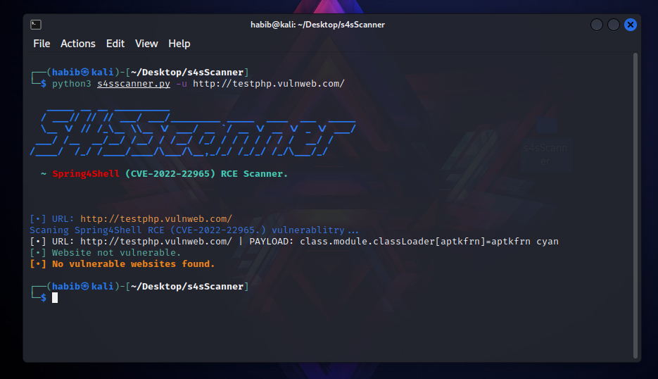

<h1 align="center">
  <br>
  <a  href="https://github.com/thenurhabib/s4sscanner"></a>
  <br>
  S4SScanner
  <br>
</h1>

<h4 align="center">Advance Spring4Shell RCE Vulnerability Scanner.</h4>

<br>

<p align="center">
  <a href="https://github.com/thenurhabib/s4sscanner/releases">
    
  </a>
  <a href="https://travis-ci.com/thenurhabib/s4sscanner">
    
  </a>
  <a href="https://github.com/thenurhabib/s4sscanner/issues?q=is%3Aissue+is%3Aclosed">
      
  </a>
</p>

<br>


<hr>

### S4SScanner is advance Spring4Shell RCE CVE-2022-22965 Vulnerability scanner that can search every url and check for vulnerability.

<br>

### Main Features
- Web Crawler
- Scan Spring4Shell RCE

<br>

### Documentation
### install
```yaml
git clone https://github.com/thenurhabib/s4sscanner.git
cd s4sscanner
pip install -r requirements.txt
```
<br>

#### Usage

```yaml
┌──(habib㉿kali)-[~/Desktop/s4sScanner]
└─$ python3 s4sscanner.py -h         

   _____ __ __ __________                                 
  / ___// // // ___/ ___/_________ _____  ____  ___  _____
  \__ \/ // /_\__ \\__ \/ ___/ __ `/ __ \/ __ \/ _ \/ ___/
 ___/ /__  __/__/ /__/ / /__/ /_/ / / / / / / /  __/ /    
/____/  /_/ /____/____/\___/\__,_/_/ /_/_/ /_/\___/_/

  ~ Spring4Shell (CVE-2022-22965) RCE Scanner.                                

    
usage: S4SScanner Help Menu.

optional arguments:
  -h, --help            show this help message and exit
  -u URL, --url URL     Single URL
  -p PROXY, --proxy PROXY
                        Use proxy
  -l USEDLIST, --list USEDLIST
                        URL List.
  --payload PAYLOADFILE
                        Use own payloads file
  --waf-bypass          Detect WAF and bypass.
  --request-type REQUESTTYPE
                        Type of requests.
  --test-CVE-2022-22963
                        Test for Spring Cloud RCE.
                                                         
```
<br>
<br>


## Scan Single URL :



<br>

### Author
```yaml
Name       : Md. Nur habib
Medium     : thenurhabib.medium.com
Twitter    : https://twitter.com/thenurhab1b
HackerRank : https://www.hackerrank.com/thenurhabib

```

##### Thank You.
